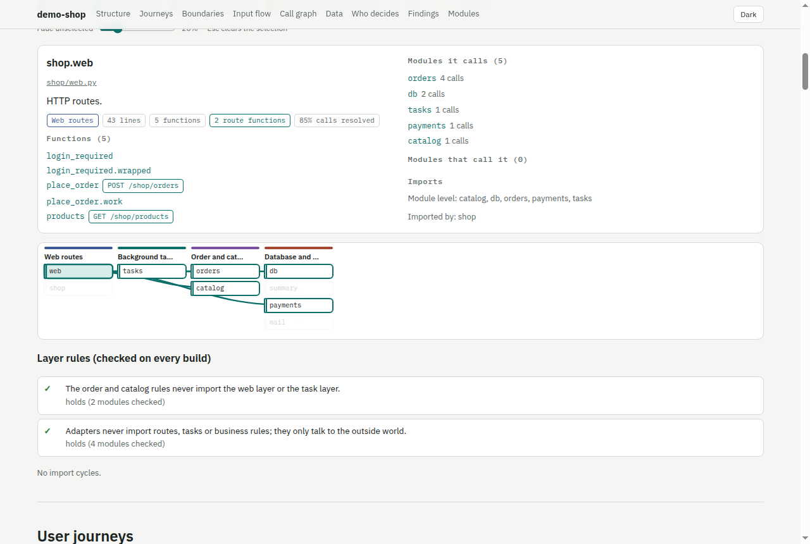
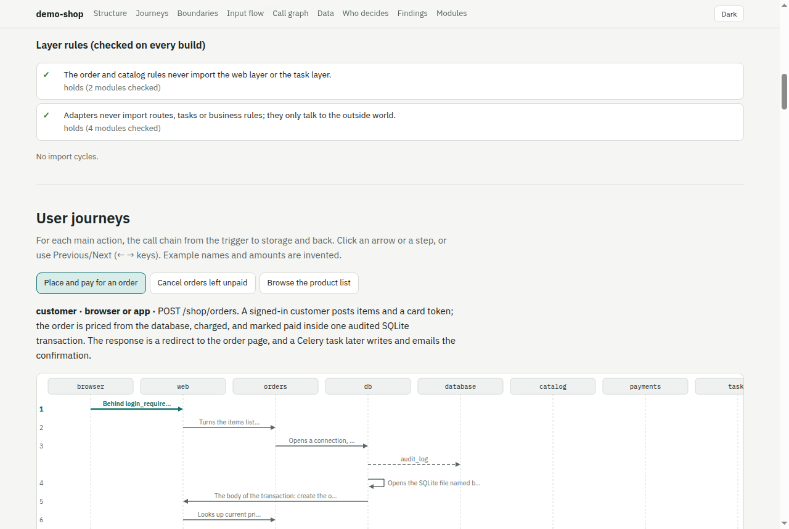

# code-flow-report

A Claude Code skill that builds an **interactive report of how a Python codebase actually works** — and keeps it honest.

- **Layers** of the codebase, with the import rules between them re-checked on every build.
- **User journeys as exact call chains**: from the click (or the scheduled job) to the database and back, step by step, with what each function receives, returns and stores, and a small example payload.
- **Boundaries and background work**: every place the code leaves its process (HTTP, cloud SDKs, databases, queues, email, files, subprocesses) and every job that runs on its own.
- **Stack profiles**, switched on only when the repo uses that stack: model calls (provider, model, settings, message roles, output schema) for LLM SDKs; tasks, schedules and enqueue sites for Celery/RQ/APScheduler/….
- **Untrusted-input paths**, **data lifecycles** per table (pulled from the SQL and ORM use), **who decides** (code vs people), and **findings** — where the docs and the code disagree, dead code, cycles, duplicated logic, risky spots.
- A searchable **call-graph explorer**. Click a node and everything not connected to it fades, so the connecting edges stand out.

One offline HTML file, English or Korean, readable on a phone.





The example above is [`examples/demo-shop`](examples/demo-shop) — an invented app — and its generated [report](examples/demo-shop/docs/code-flow/code-flow-report.html).

## How it stays honest

The structure is **extracted from the source** with Python's `ast` into `code_map.json`; nothing structural is written by hand. The explanations live in `narrative.toml` and refer to code **only by symbol name** (`shop.orders:create_order`), never by line number. Every build checks each name against the code, so when someone renames or deletes a function, the report fails its own check and says which explanation went stale, instead of quietly drifting.

## Install

```
/plugin marketplace add JinhoKim46/code-flow-report
/plugin install code-flow-report@code-flow-report
```

Requires Python 3.11+ as `python3`. No packages to install: the scripts use only the standard library and the page loads no scripts from the network.

## Use

In any Python repo, ask Claude Code something like *"how does this code work? make a code-flow report"* or run `/code-flow-report`. The skill asks three things first — report language (English by default, or Korean), depth (`quick` ≈ 3 journeys, `standard` ≈ 6, `deep` ≈ 12) and who will read it — then:

1. maps the code (seconds) and tells you how much of it it could resolve,
2. drafts the whole narrative skeleton from the map — layers, journey call chains, boundary cards, data lifecycles — so only the explanations are left to write,
3. writes those, in parallel for larger depths,
4. builds the page and checks itself: random call edges against the source, one journey walked end to end.

To regenerate after code changes: *"regenerate the code-flow report"*. `check` lists exactly which explanations went stale; only those are rewritten.

## What it adds to your repo

```
docs/code-flow/
├─ codeflow.toml            settings detected at init (editable)
├─ code_map.json            extracted structure (generated)
├─ narrative.toml           the explanations (the only hand-written file)
├─ code-flow-report.html    the report (generated)
└─ tools/                   a copy of the scripts, so anyone can rebuild without the skill:
                            python3 docs/code-flow/tools/codeflow.py build
```

Optionally, `tests/test_code_flow.py` (only if you say yes): a unittest that fails when the report no longer matches the code. That keeps the report honest **and** means every PR that moves a function must re-run `build` — the skill asks before adding it.

## Commands

All through one script (`python3 docs/code-flow/tools/codeflow.py <command>` after init):

| Command | Does |
|---|---|
| `status` | repo size, existing report?, recommended depth |
| `init` | detect settings, copy the tools into the repo |
| `map` | extract `code_map.json`, print coverage |
| `draft` | propose the narrative (`--depth quick\|standard\|deep`) |
| `candidates` | every entry point ranked as a journey candidate |
| `query SYMBOL` / `find TEXT` | a function's callers, callees, SQL, boundaries — for whoever writes the narrative |
| `todo` | what is still unwritten |
| `merge` | fold fragments written by parallel writers into the narrative |
| `build` | validate the narrative and write the page |
| `verify` | random call edges next to their source lines |
| `check` | fail if the map, the narrative or the page is out of date |
| `install-test` | add the staleness unittest |
| `report FILE.md` | render a Markdown report in the same look |

## Measured

On three real repositories, with zero configuration (details in [`docs/validation-2026-10.md`](docs/validation-2026-10.md)):

| Repository | Kind | Size | Map time | Calls resolved |
|---|---|---|---|---|
| a private Flask app + batch loader + CDK | web app | 126 files · 53k lines | 0.8 s | 81.0 % |
| fastapi/full-stack-fastapi-template | API + ORM | 27 files · 1.7k lines | 0.1 s | 94.5 % |
| httpie/cli | class-heavy CLI library | 86 files · 10.6k lines | 0.2 s | 66.5 % |

The unresolved remainder is mostly methods on objects whose type is not visible without running the code (`dict.get`, `list.append`, untyped parameters). The page shows the exact figure and the most frequent unresolved names.

## Limits

- Python only (other languages: an extractor adapter is the extension point).
- Static analysis: dynamic dispatch (`getattr`, callback tables), calls inside templates, framework hook registration and SQL assembled at runtime do not appear as edges.
- Files using syntax newer than the running Python (e.g. 3.14's unparenthesised `except A, B:` on 3.12) are skipped and listed as findings.

## Extending

A stack profile is one Python file: the import names that switch it on, a call-shape detector, and a table for the report. See [`skills/code-flow-report/references/profiles.md`](skills/code-flow-report/references/profiles.md).

## Development

```
python3 -m unittest discover -s tests -t tests     # 43 tests on fixture repos under tests/fixtures/
python3 tests/make_fixtures.py                      # regenerate the fixtures
python3 examples/make_demo.py                       # regenerate the example app
claude plugin validate . --strict
```

MIT licensed.
